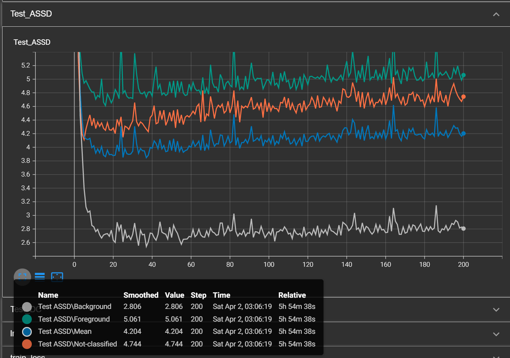

# PetSeg


## Test Environment:  
Ubuntu 20.04 server  
Intel(R) Xeon(R) Gold 5220R CPU @ 2.20GHz  
RTX A6000 48GB  
RAM 256GB  

## Train
````bash
python train.py \
--gpu_id 0 \
--batch_size 400 \
--n_epoch 200 \
--preload_dataset True
````
Around 6 hours for finishing training.
### Training monitor



Intermedia result of epoch 1, 2, and 3.


## Evaluate
````bash
python eval_and_visual.py \
--gpu_id 0 \
--batch_size 20 \
--pretrain_loading_epoch 40
````

## Result

